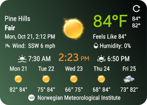
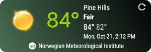

# WeatherLion-Android (Beta)
_Android Weather Widget_

#### 4x4 Widget


#### 4x2 Widget


## Outline
Weather Lion is a modern Android widget designed to display current weather information based on a selected location or by using the device's onboard **GPS** radio. The widget is designed to consume data from webservices such as:

* Dark Sky Weather
* Here Maps
* Yahoo! Weather
* Open Weather Map
* Weather Bit
* Weather Underground
* Geonames

In order for the program to use any of these service providers, the user must aquire access keys from each services provider.The following URLs can be used to obtain access to the websites:

1. [Dark Sky](https://darksky.net/dev)
1. [Geonames](http://www.geonames.org/)
1. [Here Maps](https://developer.here.com/)
1. [Open Weather Map](https://openweathermap.org/api)
1. [Weather Bit](https://www.weatherbit.io/api)
1. [Yahoo Weather](https://developer.yahoo.com/weather/)

By default, the program will be able to display weather from **Yr.no (Norwegian Metrological Institute)** as they don't require access keys. All weather access keys must be obtained from the weather providers' websites. **Yr.no (Norwegian Metrological Institute)** has indicated that their web services are undergoing changes and no longer provider weather data for places outside of Europe for the time being but, queries to the web service is still working for now.

## Technologies
The program makes use data received from the specified web services in either `JSON` or `XML` format and displays the information in an intuitive user interface. Data received is stored locally in `JSON`, `XML`, and also in a SQLite 3 database. The project is ongoing and may contain bugs which will be fixed as soon as they are spotted.   

## Important
**_Access must be supplied for any the specified weather providers and a username to use the [geonames](http://www.geonames.org/) website for city search._**

## Gradle Dependency

The following `dependencies` should be added to the **build.gradle** app file:

```groovy
    implementation 'com.google.code.gson:gson:2.8.6'
    implementation files('libs/jdom-2.0.6.jar')
    implementation 'com.squareup.okhttp3:okhttp:4.2.2'
    implementation 'com.jjoe64:graphview:4.2.1'
```
The [Jdom](http://www.jdom.org/dist/binary/) library can be downloaded and added to the libs directory of just inject the dependency directly in gradle.

## License

    The MIT License (MIT)

    Copyright (c) 2017 Paul O. Patterson

    Permission is hereby granted, free of charge, to any person obtaining a copy
    of this software and associated documentation files (the "Software"), to deal
    in the Software without restriction, including without limitation the rights
    to use, copy, modify, merge, publish, distribute, sublicense, and/or sell
    copies of the Software, and to permit persons to whom the Software is
    furnished to do so, subject to the following conditions:

    The above copyright notice and this permission notice shall be included in all
    copies or substantial portions of the Software.

    THE SOFTWARE IS PROVIDED "AS IS", WITHOUT WARRANTY OF ANY KIND, EXPRESS OR
    IMPLIED, INCLUDING BUT NOT LIMITED TO THE WARRANTIES OF MERCHANTABILITY,
    FITNESS FOR A PARTICULAR PURPOSE AND NONINFRINGEMENT. IN NO EVENT SHALL THE
    AUTHORS OR COPYRIGHT HOLDERS BE LIABLE FOR ANY CLAIM, DAMAGES OR OTHER
    LIABILITY, WHETHER IN AN ACTION OF CONTRACT, TORT OR OTHERWISE, ARISING FROM,
    OUT OF OR IN CONNECTION WITH THE SOFTWARE OR THE USE OR OTHER DEALINGS IN THE
    SOFTWARE.
